# Realistic Improvement Plan — Student Edition

## Architecture Overview: Before vs After

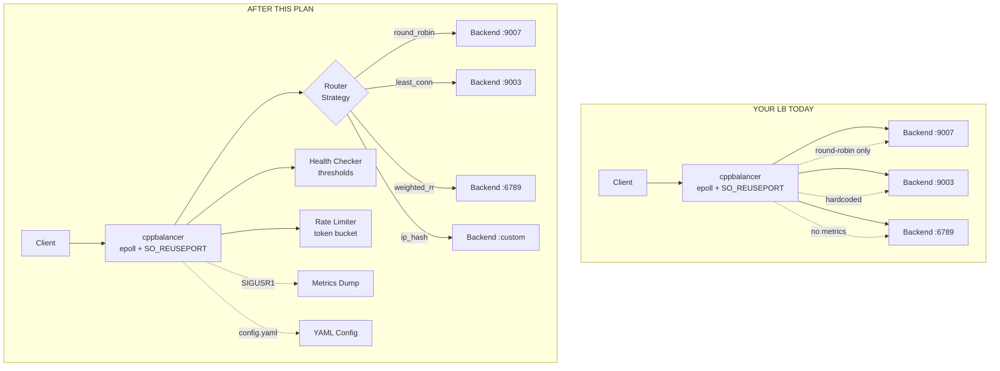

---

## What Interviewers See vs What They Expect

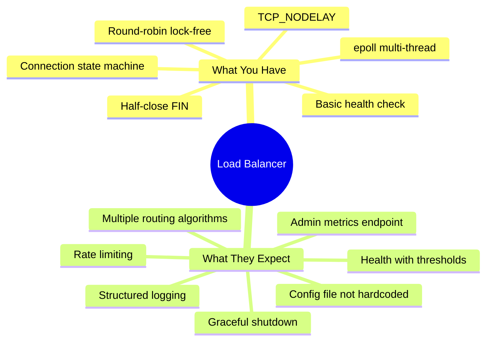

---

## The Plan — 6 Changes, One File

Everything goes into `cppbalancer.cpp`. No CMake, no new files.
Build command stays the same:

```bash
g++ -O2 -std=c++17 -pthread -o cppbalancer cppbalancer.cpp
```

---

### Change 1: YAML Config File

**Why:** Interviewer sees hardcoded ports and knows you can't run this in production without recompiling.

**File:** `config.yaml`
```yaml
listen_port: 8181
workers: 4

backends:
  - { addr: "127.0.0.1", port: 9007, weight: 100 }
  - { addr: "127.0.0.1", port: 9003, weight: 100 }
  - { addr: "127.0.0.1", port: 6789, weight: 50 }

algorithm: "round_robin"

health_check:
  interval: 5
  timeout: 2
  healthy_threshold: 3
  unhealthy_threshold: 2

idle_timeout: 300
```

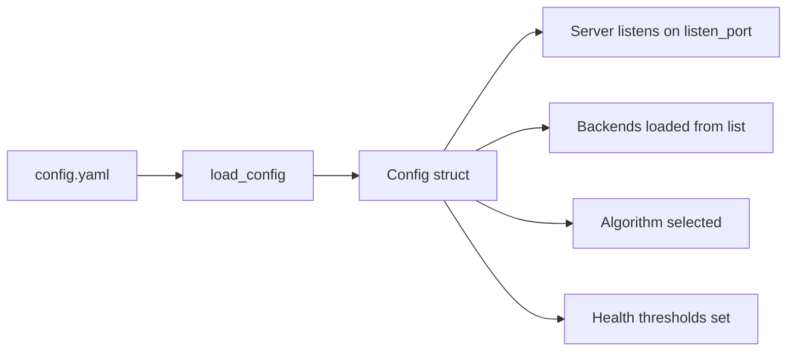

**Implementation (~40 lines):**
```cpp
struct Config {
    int listen_port = 8181;
    int workers = 4;
    std::string algorithm = "round_robin";
    int health_interval = 5;
    int healthy_threshold = 3;
    int unhealthy_threshold = 2;
    int idle_timeout = 300;
    struct BackendCfg { std::string addr; int port; int weight; };
    std::vector<BackendCfg> backend_list;
};

Config load_config(const std::string& path) {
    Config cfg;
    std::ifstream f(path);
    std::string line;
    while (std::getline(f, line)) {
        // trim whitespace, skip comments (#)
        // parse "key: value" and "- { addr: ..., port: ..., weight: ... }"
    }
    return cfg;
}
```

**Interview impact:** Shows you understand operational concerns.

---

### Change 2: Multiple Routing Algorithms (Strategy Pattern)

**Why:** Round-robin only is the #1 thing interviewers call out.

**Add ~120 lines.** Keep the Router as an interface, implement 4 algorithms:

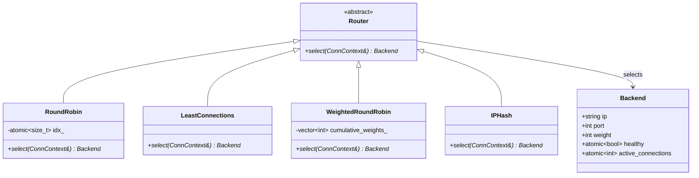

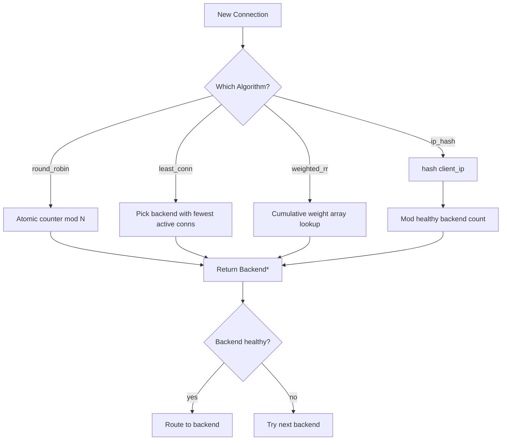

**Concrete algorithms:**

```cpp
// 1. Round Robin (already exists — refactor into class)
class RoundRobin : public Router {
    std::atomic<size_t> idx_{0};
    Backend* select(ConnContext&) override {
        size_t n = backends.size();
        for (size_t i = 0; i < n; ++i) {
            size_t cur = idx_.fetch_add(1) % n;
            if (backends[cur]->healthy) return backends[cur].get();
        }
        return nullptr;
    }
};

// 2. Least Connections
class LeastConnections : public Router {
    Backend* select(ConnContext&) override {
        Backend* best = nullptr;
        int64_t min = INT64_MAX;
        for (auto& b : backends) {
            if (!b->healthy) continue;
            int64_t conns = b->active_connections.load();
            if (conns < min) { min = conns; best = b.get(); }
        }
        return best;
    }
};

// 3. Weighted Round Robin
class WeightedRoundRobin : public Router {
    // Build cumulative weight array, pick by position
};

// 4. IP Hash (session affinity)
class IPHash : public Router {
    Backend* select(ConnContext& ctx) override {
        // hash(client_ip) % healthy_backends.size()
    }
};
```

**Backend struct change:**
```cpp
struct Backend {
    std::string ip;
    int port;
    int weight;                              // NEW
    std::atomic<bool> healthy{true};
    std::atomic<int> consecutive_failures{0}; // NEW
    std::atomic<int> active_connections{0};
};
```

**Interview impact:** Shows design patterns + algorithm awareness.

---

### Change 3: Health Check with Thresholds

**Why:** Single-shot health check causes flapping. Interviewers know this.

**Current behavior (line 195-214):**
```cpp
b->healthy = (ret == 0);  // one failure = dead
```

**Health Check State Machine:**

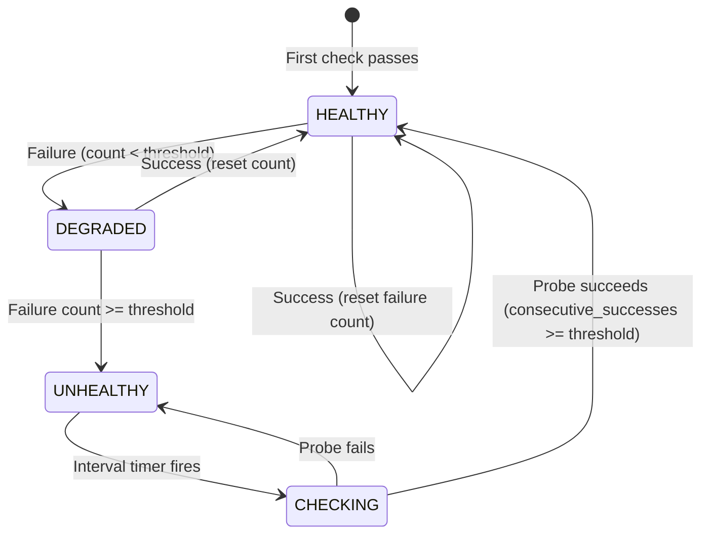

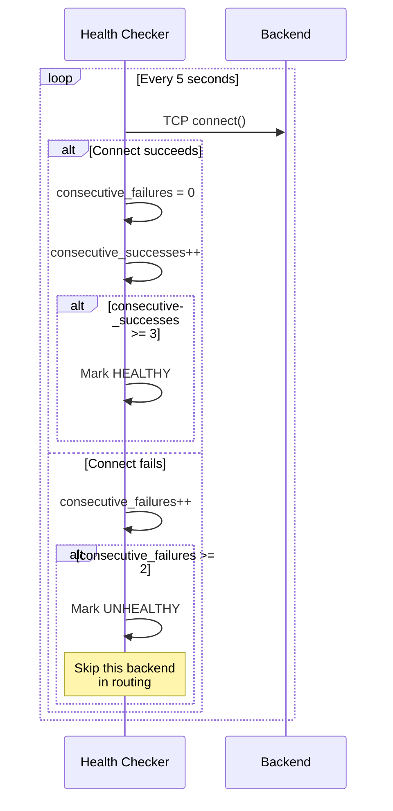

**Implementation:**
```cpp
void backend_health_checker() {
    while (true) {
        for (auto& b : backends) {
            int sock = socket(AF_INET, SOCK_STREAM, 0);
            // ... existing connect logic ...
            int ret = connect(sock, ...);
            close(sock);

            if (ret == 0) {
                b->consecutive_failures = 0;
                if (!b->healthy) {
                    b->consecutive_successes++;
                    if (b->consecutive_successes >= healthy_threshold) {
                        b->healthy = true;
                        Log::info("HEALTH", b->ip + ":" + std::to_string(b->port) + " HEALTHY");
                    }
                }
            } else {
                b->consecutive_successes = 0;
                b->consecutive_failures++;
                if (b->healthy && b->consecutive_failures >= unhealthy_threshold) {
                    b->healthy = false;
                    Log::warn("HEALTH", b->ip + ":" + std::to_string(b->port) + " UNHEALTHY");
                }
            }
        }
        std::this_thread::sleep_for(std::chrono::seconds(health_interval));
    }
}
```

**Interview impact:** Shows you understand production failure modes.

---

### Change 4: Graceful Shutdown + Signal Handling

**Why:** Without this, SIGTERM kills all in-flight requests. Interviewers test this.

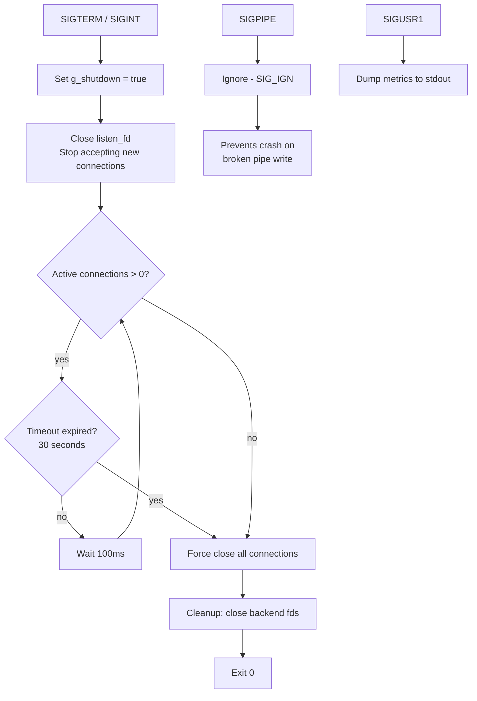

**Implementation (~30 lines):**
```cpp
#include <csignal>

std::atomic<bool> g_shutdown{false};
std::atomic<int> g_active_conns{0};

void signal_handler(int sig) {
    if (sig == SIGUSR1) {
        g_metrics.dump();
        return;
    }
    Log::info("SHUTDOWN", "Received signal " + std::to_string(sig)
              + ", draining connections...");
    g_shutdown = true;
}

// In main():
struct sigaction sa{};
sa.sa_handler = signal_handler;
sigemptyset(&sa.sa_mask);
sigaction(SIGTERM, &sa, nullptr);
sigaction(SIGINT, &sa, nullptr);
sigaction(SIGUSR1, &sa, nullptr);
signal(SIGPIPE, SIG_IGN);

// In worker_thread() accept loop:
if (g_shutdown.load()) {
    close(listen_fd);
    break;
}

// Cleanup with timeout:
auto deadline = std::chrono::steady_clock::now() + std::chrono::seconds(30);
while (g_active_conns > 0 && std::chrono::steady_clock::now() < deadline) {
    std::this_thread::sleep_for(std::chrono::milliseconds(100));
}
```

**Interview impact:** Shows you understand ops/deployment reality.

---

### Change 5: Structured Logging + Basic Metrics

**Why:** `cout` messages aren't production logging. Interviewers expect structured output.

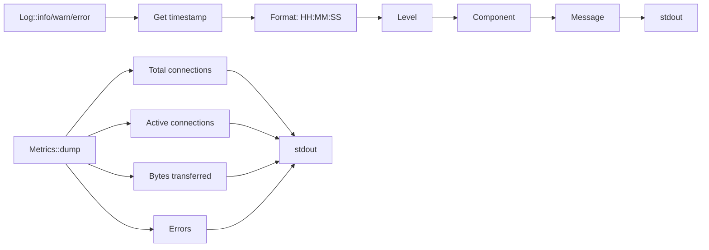

**Add ~80 lines:**

```cpp
struct Log {
    static void info(const std::string& component, const std::string& msg) {
        auto now = std::chrono::system_clock::now();
        auto t = std::chrono::system_clock::to_time_t(now);
        char timebuf[20];
        std::strftime(timebuf, sizeof(timebuf), "%H:%M:%S", std::localtime(&t));
        std::cout << "[" << timebuf << "] [INFO] [" << component << "] " << msg << "\n";
    }
    static void warn(const std::string& component, const std::string& msg) {
        // same pattern with [WARN]
    }
    static void error(const std::string& component, const std::string& msg) {
        // same pattern with [ERROR]
    }
};

struct Metrics {
    std::atomic<uint64_t> total_connections{0};
    std::atomic<uint64_t> bytes_transferred{0};
    std::atomic<uint64_t> errors{0};

    void dump() {
        std::cout << "\n=== Load Balancer Metrics ===\n"
                  << "Total connections:  " << total_connections << "\n"
                  << "Active connections: " << g_active_conns << "\n"
                  << "Bytes transferred:  " << bytes_transferred << "\n"
                  << "Errors:             " << errors << "\n"
                  << "============================\n\n";
    }
} g_metrics;
```

**Interview impact:** Shows observability awareness.

---

### Change 6: Rate Limiting (Token Bucket)

**Why:** No protection against a single client overwhelming backends.

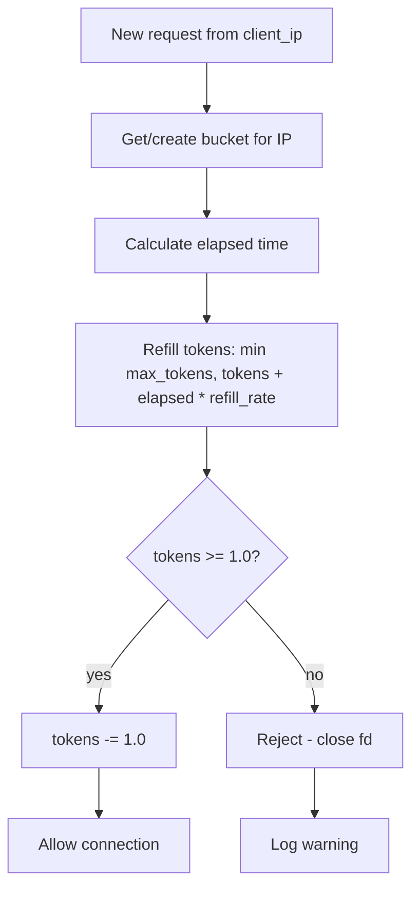

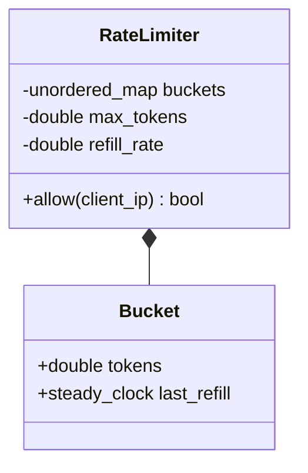

**Add ~50 lines:**

```cpp
class RateLimiter {
    struct Bucket {
        double tokens;
        std::chrono::steady_clock::time_point last_refill;
    };
    std::unordered_map<std::string, Bucket> buckets_;
    double max_tokens_;
    double refill_rate_;

public:
    RateLimiter(double max, double rate) : max_tokens_(max), refill_rate_(rate) {}

    bool allow(const std::string& client_ip) {
        auto now = std::chrono::steady_clock::now();
        auto& b = buckets_[client_ip];
        if (b.tokens == 0) b.last_refill = now;
        auto elapsed = std::chrono::duration<double>(now - b.last_refill).count();
        b.tokens = std::min(max_tokens_, b.tokens + elapsed * refill_rate_);
        b.last_refill = now;
        if (b.tokens >= 1.0) { b.tokens -= 1.0; return true; }
        return false;
    }
};

// Usage in accept():
if (!g_rate_limiter.allow(client_ip)) {
    Log::warn("RATELIMIT", "Rejected " + client_ip);
    close(cfd);
    continue;
}
```

**Interview impact:** Shows security thinking.

---

## Full Request Flow (After All Changes)

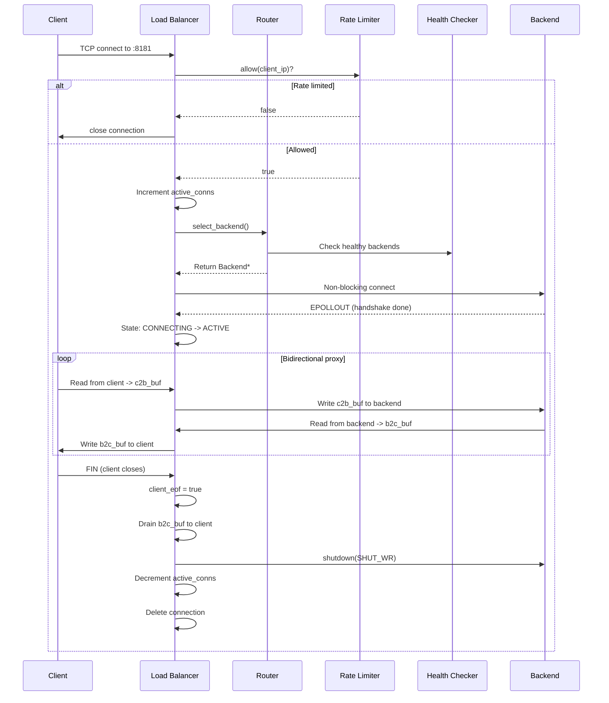

---

## What to Skip (Not Worth It for a Student)

| Feature | Why Skip |
|---------|----------|
| TLS termination | Complex, needs OpenSSL, not core LB logic |
| HTTP parsing (L7) | Massive scope, your L4 proxy is fine |
| Connection pooling | Your buffer approach works for demo |
| CMake | Your g++ command is fine for one file |
| Admin HTTP API | The metrics dump on signal is enough |
| Consistent hashing | IP hash is sufficient |
| Circuit breaker | Overkill for student project |
| Hot-reload config | Not expected |
| Cross-platform | Linux-only is fine |

---

## Interview Talking Points

When they ask "what does your load balancer do":

> "It's an L4 TCP load balancer using Linux epoll with SO_REUSEPORT for multi-core scaling. It supports 4 routing algorithms — round-robin, least connections, weighted round-robin, and IP hash — selected via a strategy pattern. Health checking uses consecutive failure thresholds to avoid flapping. It handles graceful shutdown with connection draining, has structured logging and metrics on SIGUSR1, and rate-limits clients using a token bucket algorithm. Configuration is externalized to a YAML file."

---

## Implementation Timeline

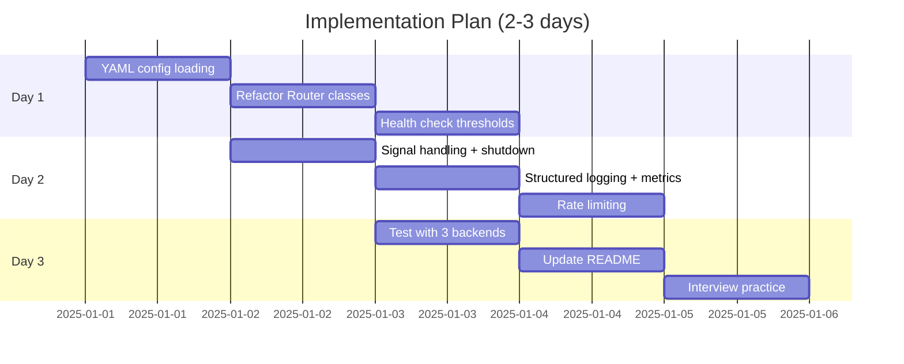

---

## Final File Structure

```
loadbalancer_c/
├── cppbalancer.cpp      (all changes in this one file)
├── config.yaml          (new — external configuration)
├── test_server.py       (existing)
├── test_client.py       (existing)
├── README.md            (update with new features)
└── IMPROVEMENT_PLAN.md  (this file)
```

Build: `g++ -O2 -std=c++17 -pthread -o cppbalancer cppbalancer.cpp`
