# Submission — Screen Recording Walkthrough Script

## Opening

"Hi, my name is [Your Name] and this is my Pipeline Builder project. It is a visual workflow editor where users can create data processing pipelines by dragging and dropping nodes onto a canvas, connecting them together, and then running the pipeline to see results. Let me walk you through the application."

---

## Part 1: The Interface

"So when you first open the app, you see three main sections. At the top is the toolbar with all the available node types. In the middle is the canvas where you build your pipeline. And at the bottom there is the submit section with two buttons — Analyze and Run Pipeline."

"The toolbar has 9 different node types: Input, LLM, Output, Text, Math, Filter, Merge, Split, and Transform. Each one does something different."

---

## Part 2: Building a Pipeline

"Let me show you how to build a pipeline. I will drag an Input node onto the canvas."

"[Drag Input node from toolbar to canvas]"

"You can see the node appears on the canvas. It has a name field and a type dropdown. Let me name this 'username' and keep the type as Text."

"Now I will drag a Text node."

"[Drag Text node to canvas]"

"The Text node is special. It has a textarea where I can type text, and it supports variables. Watch — if I type double curly brackets and a variable name like this..."

"[Type '{{name}}' in the textarea]"

"You can see that a new handle appears on the left side of the node. This is a dynamic handle that lets other nodes connect data to this variable. The node also auto-resizes as I type more text."

"Now let me drag an LLM node."

"[Drag LLM node to canvas]"

"The LLM node has two inputs on the left — system and prompt — and one output on the right called response. This connects to Google's Gemini AI model."

"Finally, I will drag an Output node."

"[Drag Output node to canvas]"

"The Output node shows the final result of the pipeline."

---

## Part 3: Connecting Nodes

"Now I need to connect these nodes. I will drag from the Input node's output handle to the Text node's 'name' handle."

"[Drag connection from Input to Text]"

"You can see a line appears between them. This means data will flow from the Input to the Text node."

"Now I connect the Text node's output to the LLM node's prompt input."

"[Drag connection from Text to LLM]"

"And finally, the LLM's response to the Output node."

"[Drag connection from LLM to Output]"

"So now we have a complete pipeline: Input sends a name, Text creates a message using that name, LLM processes it with AI, and Output shows the result."

---

## Part 4: Running the Pipeline

"Let me run this pipeline. I will click Run Pipeline."

"[Click Run Pipeline]"

"You can see the output panel appears at the bottom. It shows that the pipeline executed successfully, and the result from the Output node is displayed. It also shows the execution time."

"If I expand the Node Outputs section, you can see what each node produced. The Input node output 'username', the Text node output 'Hello username, how are you?', the LLM node called Gemini and got an AI response, and the Output node shows the final result."

---

## Part 5: Analyzing the Pipeline

"There is also an Analyze button. Let me click it."

"[Click Analyze]"

"This sends the pipeline to the backend which counts the number of nodes and edges, and checks if the pipeline is a valid DAG — a Directed Acyclic Graph with no cycles. It shows an alert with the results."

---

## Part 6: More Node Types

"Let me show you some other nodes. Here is a Math node."

"[Drag Math node to canvas]"

"It has two inputs — A and B — and an output called result. You can choose the operation: add, subtract, multiply, or divide."

"Here is a Filter node."

"[Drag Filter node to canvas]"

"It has one input and two outputs — pass and fail. Based on the condition you set, data goes to either the pass or fail output."

"Here is a Transform node."

"[Drag Transform node to canvas]"

"It takes text input and transforms it — uppercase, lowercase, reverse, or trim."

---

## Part 7: System Design

"Now let me explain the system design — how I structured the application and why I made certain decisions."

### 7.1 Whole System Architecture

"I split the system into two parts: a React frontend and a Python FastAPI backend."

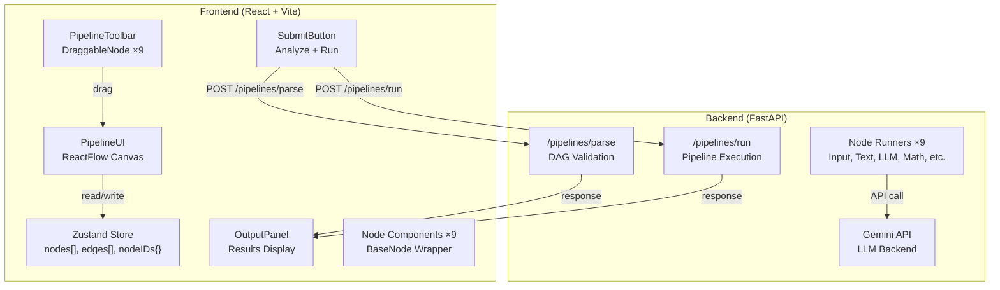

**Why split frontend and backend:**
- LLM API calls need a server-side key (cannot expose API keys in browser)
- Graph algorithms (topological sort) are faster in Python
- Drag-and-drop needs instant browser feedback (no network delay)
- Backend can be reused by other clients (mobile, CLI)

### 7.2 Zustand Store

"All shared state lives in a single Zustand store. I chose Zustand over Redux because it needs less boilerplate — one `create()` call instead of actions, reducers, and dispatch. I chose it over Context API because Zustand uses selectors to only re-render what changes, while Context re-renders everything."

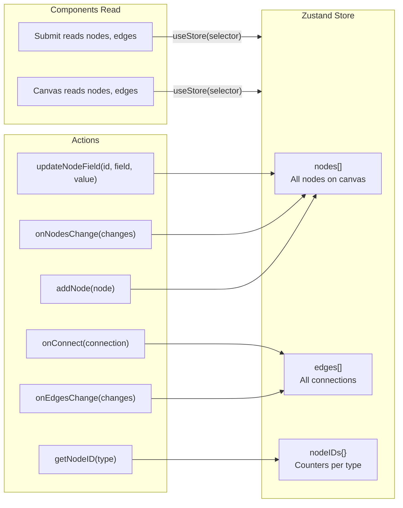

### 7.3 Key Decisions Made

#### Frontend Decisions

**1. BaseNode Abstraction — Why I created it:**

The problem was code duplication. Every node file (Input, Output, LLM, Text, etc.) had the same structure: a container div, a title section, handles on the left and right, and content in the middle. The only difference was the content inside and the handle configuration. I was rewriting 50 lines of the same code for every new node.

I created BaseNode to encapsulate the common structure. It takes three props: `title` (string), `handles` (array of handle configs), and `children` (the custom content). BaseNode filters handles into target (left) and source (right), renders the title, and renders the children.

Why not a Higher-Order Component (HOC)? HOCs add wrapper layers which make debugging harder and change the component's identity. Why not render props? They create nesting issues and have a more complex API. BaseNode is simpler — it is just a regular component that accepts children. This is the standard React pattern for composition.

The result: each node went from 50 lines to 15 lines. Adding a new node takes 5 minutes instead of 30.

**2. useNodeState Hook — Why I created it:**

Every editable field in a node needed to sync with the Zustand store. The pattern was always the same: useState for local state, useEffect to watch for changes, and updateNodeField to push the value to the store. That is 3-4 lines per field, repeated across all 9 node types.

I wrapped this into a custom hook called useNodeState. It takes three arguments: id, fieldName, and defaultValue. It returns [value, setValue] just like useState. Internally, it handles the store sync automatically.

Why a custom hook? It is the recommended React pattern for sharing stateful logic. It reduces boilerplate from 3-4 lines to 1 line per field. It is easy to extend — if I need to add validation or logging later, I only change one place. And it makes every node behave consistently.

**3. Auto-Registration (nodeConfig.js) — Why I created it:**

Adding a new node originally required editing 4 files: create the component, import it in ui.jsx, add it to the nodeTypes object, and add a DraggableNode in toolbar.jsx. This is error-prone and tedious.

I created nodeConfig.js as a single source of truth. It maps node type names to their component, label, and type. From this one object, I auto-generate nodeTypes (for ReactFlow) and toolbarNodes (for the toolbar). Now adding a new node only requires 2 steps: create the component file and add one entry to nodeConfig.js.

Why not filesystem-based auto-import (require.context)? That is Vite-specific and makes debugging harder because imports are implicit. Why not a decorator pattern? That is over-engineered for this use case. The nodeConfig object is simple, explicit, and works with any build tool.

**4. Zustand over Redux/Context — Why I chose it:**

I needed state management for nodes, edges, and node IDs. Redux requires actions, reducers, dispatch, and a provider — too much boilerplate for this project. Context API re-renders ALL consumers on every change, which is slow when nodes and edges change frequently.

Zustand solves both problems. One create() call sets up the store. Selectors ensure components only re-render when their specific data changes. No provider needed. The API is minimal: just get() and set().

#### Backend Decisions

**5. Kahn's Algorithm over DFS — Why I chose it:**

The backend needs to determine execution order for nodes. A node can only run after all its inputs are ready. This is a topological sort problem.

DFS (Depth-First Search) is the other common approach, but it has two problems: it uses recursion, which crashes on large graphs (Python's default recursion limit is 1000), and it only returns a boolean (cycle or no cycle), not the actual order.

Kahn's algorithm is iterative (uses a queue, no recursion limit), returns the topological order (which I need for execution), and naturally detects cycles (if not all nodes are processed, the remaining ones are in a cycle). It is also simpler to understand: count in-degrees, process nodes with in-degree 0, reduce neighbor in-degrees, repeat.

**6. Modular Runners — Why I created them:**

I could have put all node execution logic in main.py, but that would create a massive file with if-else chains for every node type. Adding a new node would mean editing main.py and adding another branch.

Instead, each node type has its own runner file (input_runner.py, text_runner.py, etc.). A RUNNERS dict maps node type names to their runner modules. When executing, I look up the runner: `runner = RUNNERS.get(node_type)`. Each runner exports a `run(node_data, inputs)` function.

Why not a class hierarchy? That would be over-engineered for simple operations like "add two numbers" or "uppercase text." Runner modules are simpler — just functions in files. Adding a new node type means creating one new runner file and adding one entry to the RUNNERS dict. main.py never needs to be edited.

**7. Handle Name Cleaning — Why I created it:**

ReactFlow requires unique handle IDs across the entire canvas, so it uses prefixes like `text-2-name` and `llm-3-prompt`. But the backend runners expect simple names like `name` and `prompt`.

I created a clean_handle_name function that strips the node ID prefix. `text-2-name` becomes `name`. `llm-3-prompt` becomes `prompt`. This bridges the gap between ReactFlow's naming convention and what the runners expect.

Without this, I would need to write complex matching logic in every runner to handle the full prefixed names. Cleaning once in the main execution loop keeps all runners simple.

**8. Environment Variables (.env) — Why I used it:**

API keys should never be hardcoded in source code. If I committed the Gemini API key to git, anyone with access to the repo could use it. The .env file stores secrets locally and is excluded from git via .gitignore.

python-dotenv loads the .env file into os.environ at startup. Any module can then access the key with os.getenv('GEMINI_API_KEY'). This is the standard practice for all Python projects.

**9. CORS Middleware — Why I added it:**

The frontend runs on port 5173 (Vite dev server) and the backend on port 8000 (Uvicorn). Browsers block cross-origin requests by default (Same-Origin Policy). Without CORS headers, every fetch() call from the frontend to the backend would fail.

CORSMiddleware with allow_origins=["*"] tells the browser to allow requests from any origin. This is fine for development. In production, I would whitelist specific domains.

---

## Part 8: The Code (Detailed)

"Let me walk through the code architecture in detail."

### 8.1 System Architecture

"The system has two main parts — a React frontend and a Python FastAPI backend."

### 8.2 Frontend Component Tree

"The frontend follows a component hierarchy."

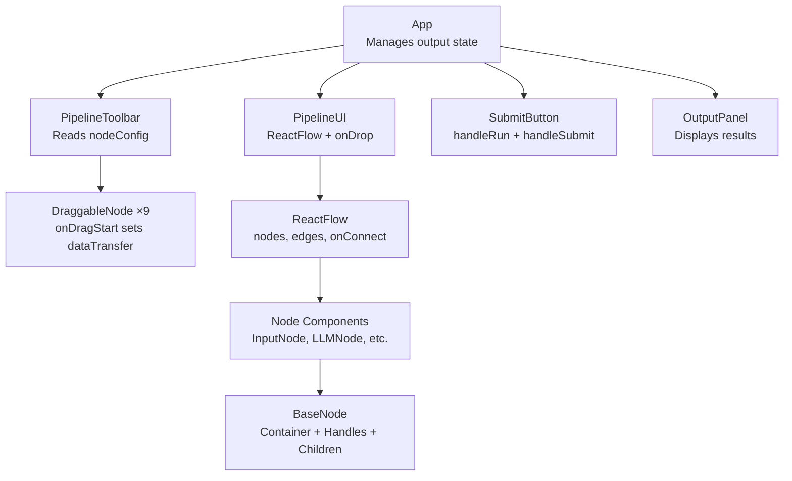

### 8.3 State Management with Zustand

"All shared state lives in a single Zustand store."

### 8.4 BaseNode Abstraction

"BaseNode is the core abstraction that reduces code duplication."

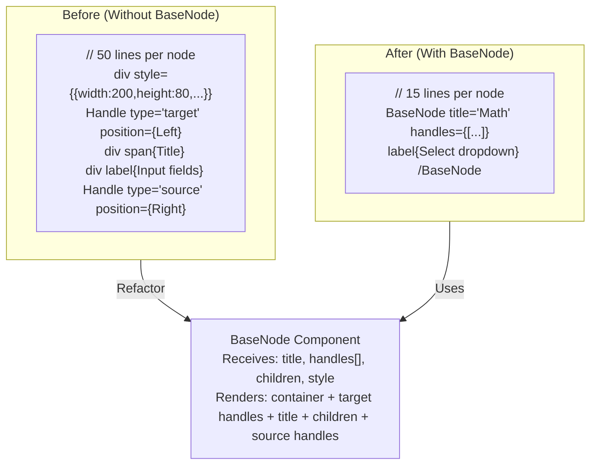

**BaseNode renders:**
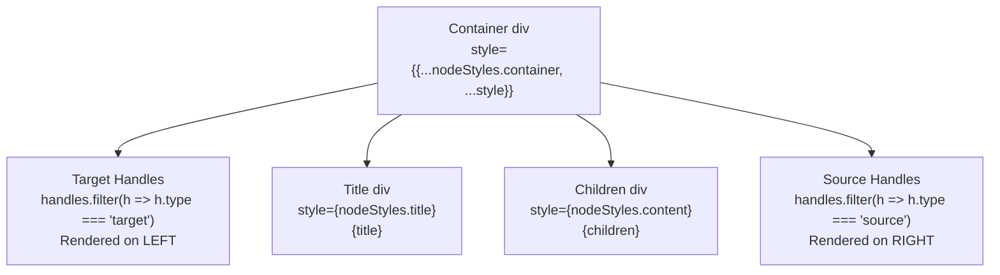

### 8.5 useNodeState Hook

"This hook reduces 3-4 lines of boilerplate to 1 line."

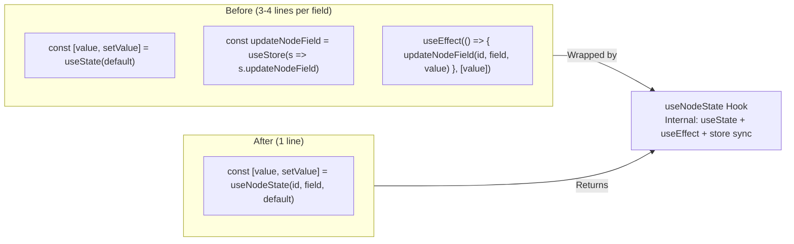

### 8.6 Auto-Registration System

"Adding a new node requires only 2 steps."

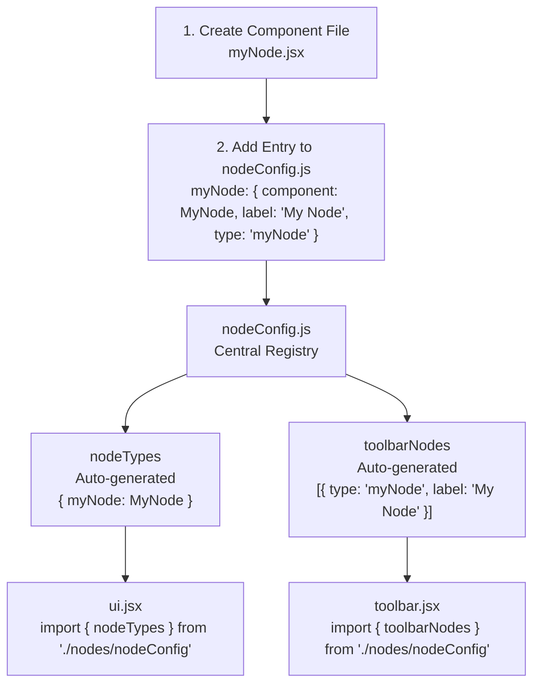

### 8.7 Node Config Registry

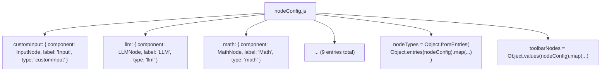

### 8.8 Backend Architecture

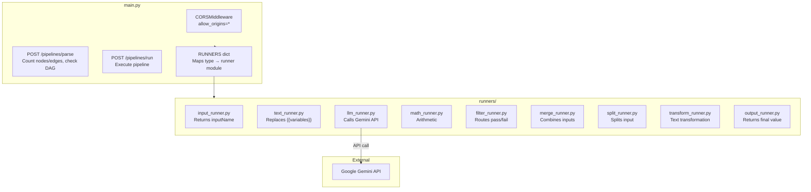

### 8.9 Backend Execution Flow

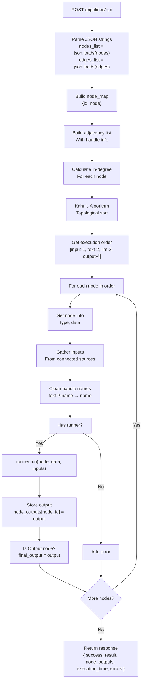

### 8.10 Handle Name Cleaning

"ReactFlow uses full handle IDs like `text-2-name`. The backend strips the prefix to get the meaningful name `name`."

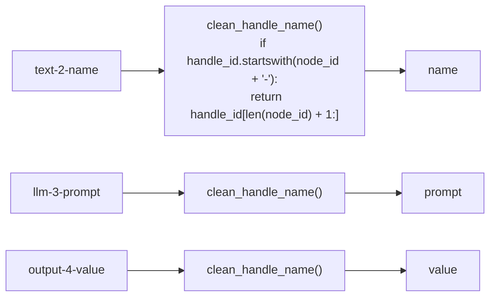

### 8.11 Runner Interface

"Each runner follows the same interface — receive node_data and inputs, return output."

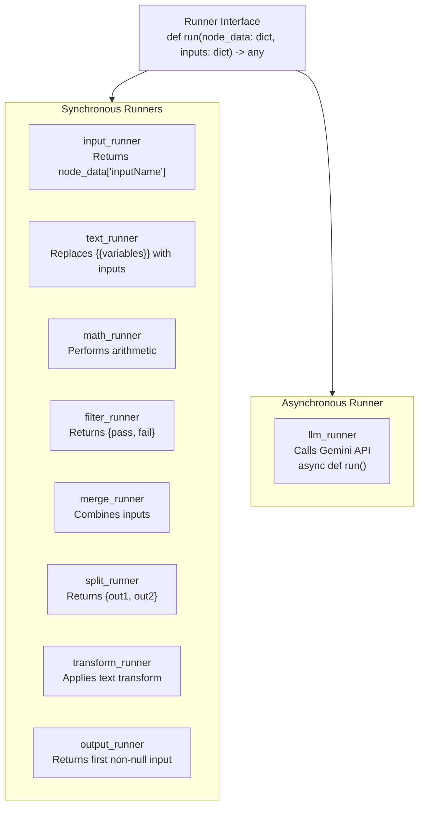

### 8.12 Data Flow Through Pipeline

"When a pipeline runs, data flows through edges from source to target."

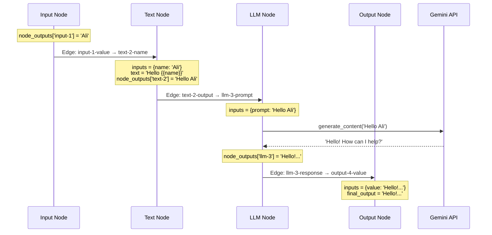

### 8.13 Frontend-Backend Communication

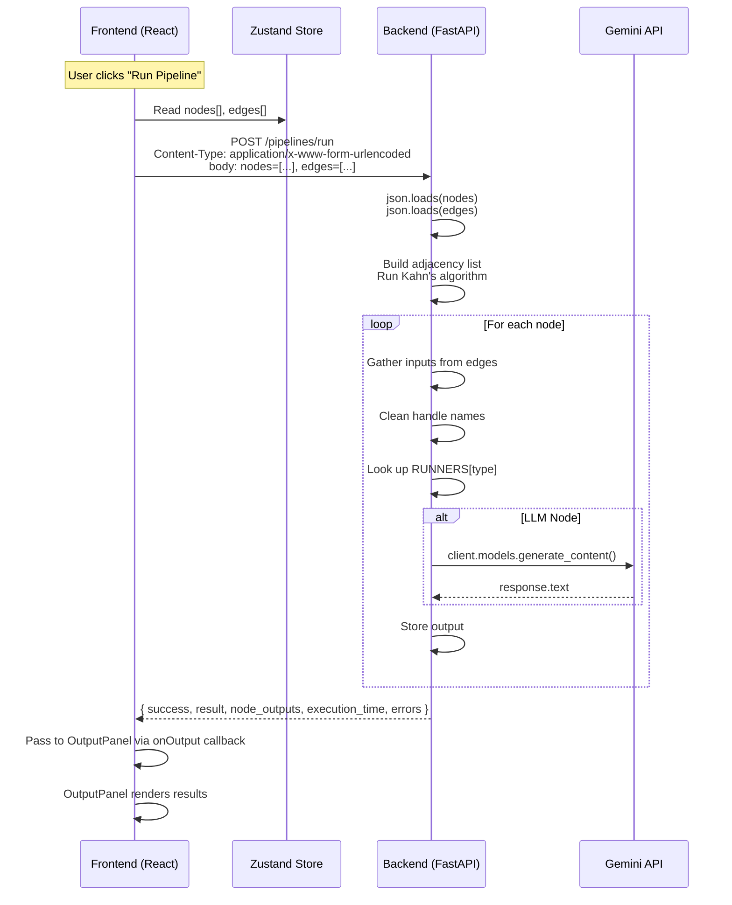

### 8.14 File Structure Summary

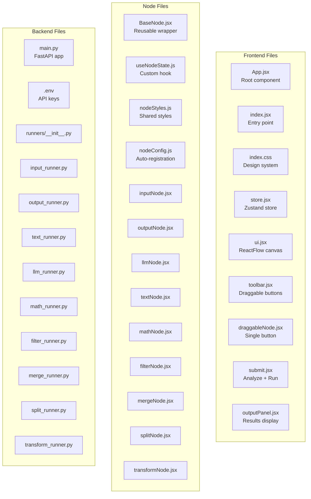

---

## Part 9: Closing

"So that is my Pipeline Builder project. It lets users visually create pipelines, connect nodes together, and run them to see results. The code is modular and easy to extend — adding a new node type requires just creating a component file and adding one entry to the config."

"Thank you for watching."

---

## Key Features to Highlight

1. **Drag-and-drop** — intuitive node placement
2. **Dynamic handles** — Text node creates handles for {{variables}}
3. **Auto-resize** — Text node grows with content
4. **Node abstraction** — BaseNode reduces code duplication
5. **Auto-registration** — nodeConfig makes adding nodes easy
6. **Real execution** — actually runs pipelines, not just visual
7. **AI integration** — Gemini API for LLM nodes
8. **DAG validation** — Kahn's algorithm checks for cycles
9. **Output panel** — shows results in a clean terminal-like UI
10. **Clean design** — modern, professional look

---

## Things to Show

- [ ] Open the app, show the toolbar and canvas
- [ ] Drag 4 nodes: Input, Text, LLM, Output
- [ ] Connect them in order
- [ ] Type a variable in Text node, show dynamic handle appearing
- [ ] Click Run Pipeline, show output panel with results
- [ ] Click Analyze, show the alert
- [ ] Show a Math node with operation dropdown
- [ ] Show a Filter node with pass/fail outputs
- [ ] Briefly show the code structure
- [ ] End with summary
